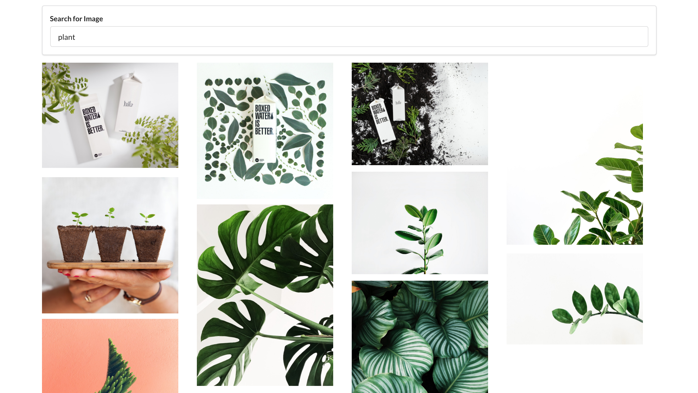

# Unsplash API Pictures

Search and display images fetched from the Unsplashed API.

## Setup and Start Project

```bash
cd picture
yarn install && yarn start
```

When the browser opens, you can type a search term.

