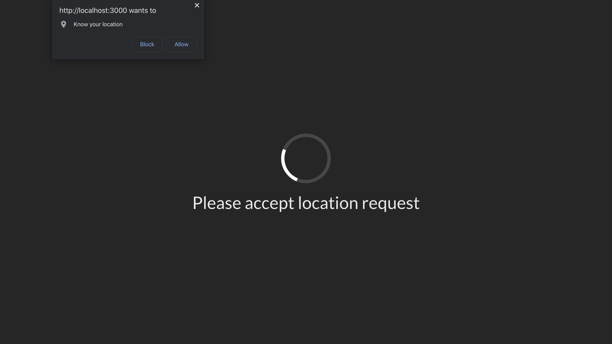
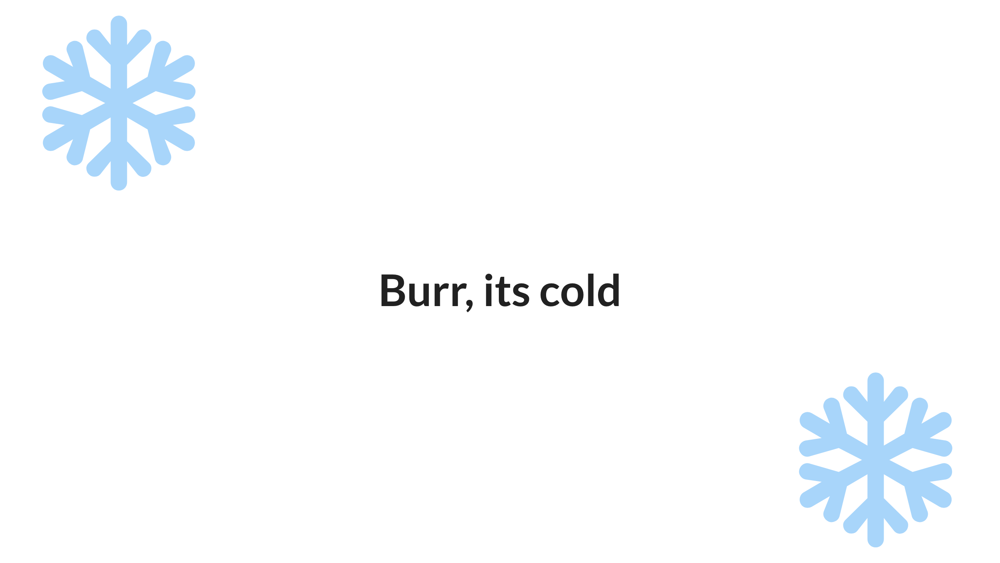
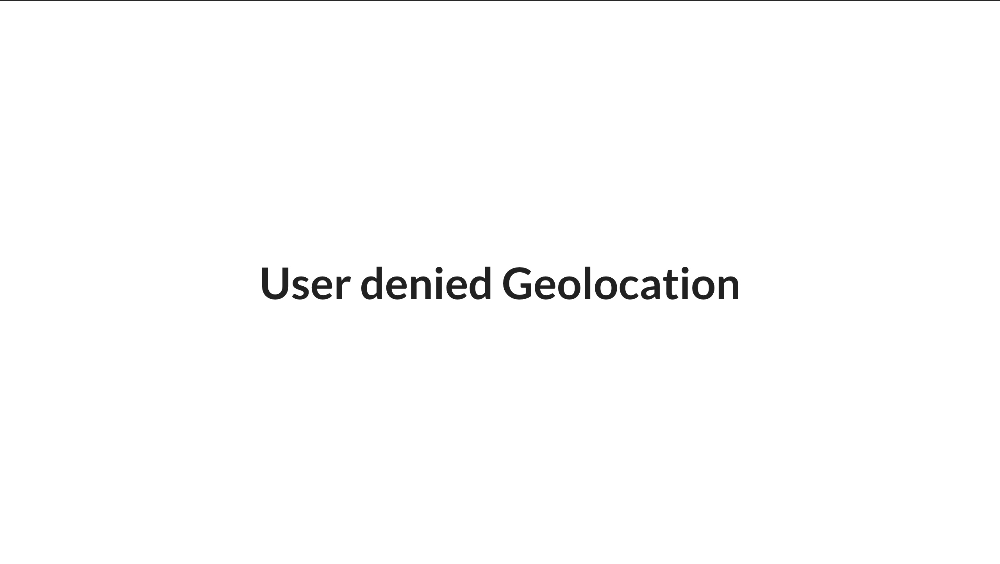

# Seasons

Determine the user's season based on their geographic location. We make use of
the geo location API from google. In terms of UX, we covered 3 different
scenarios (ask for permission, show results, denied access).

## Setup and Start project

```bash
cd season
yarn install && yarn start
```

When the browser opens, click on the website to start the gelocation process.

## User gets asked for permission

If a user loads the site for the first time he/she will be asked for permission
to access their geographic location:



## User gets shown the result

After a User allowed geographic access, we show the user our result:




## User denies permission

If a User decides to deny acess, we let the User know what went wrong:


