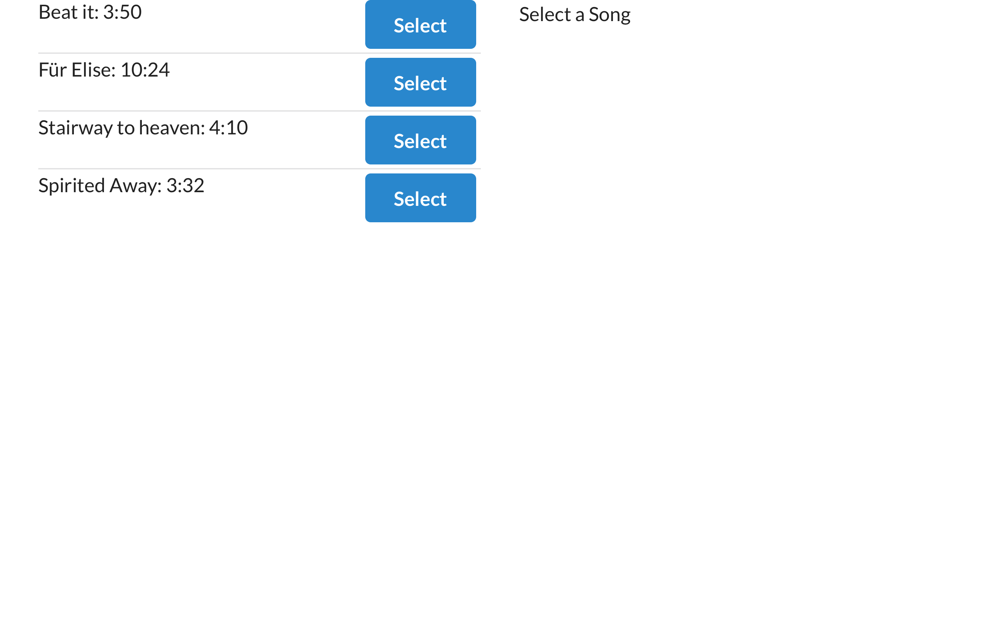
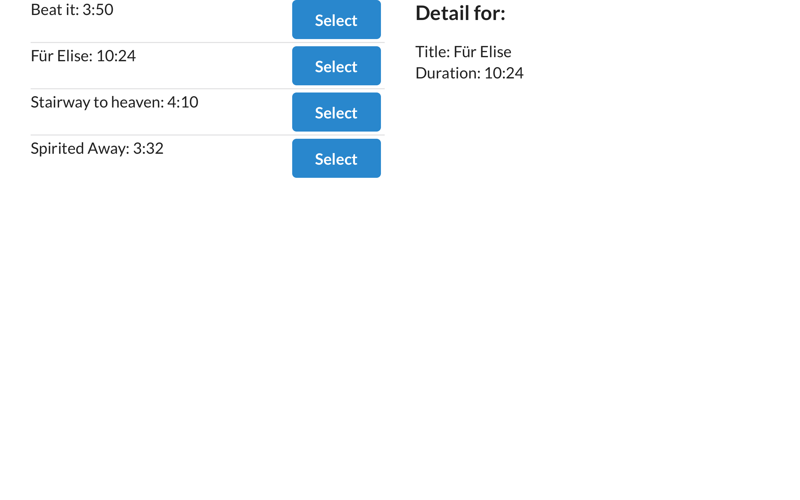

# Songs with Redux

Take initial steps with redux by displaying songs from the redux store and
dispatching a select action to get more information about a song.

## Setup and Start Project

```bash
cd songs-redux
yarn install && yarn start
```

<center>
  
  
</center>
